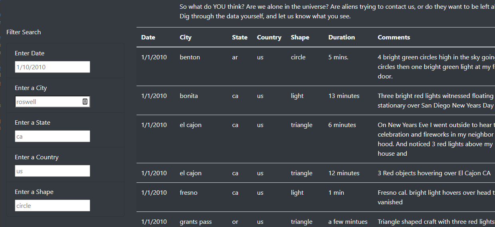

# UFOs
 Javascript

### Module 11 UFOs Challenge 
**App Js:** [UFO js](static/js/app.js)

**Index Html:** [Webpage Html](index.html)

## Overview of UFOs Challenge:
The purpose of this analysis is to build new filters to update our table accordingly.

## Results:
- When looking for a particular row or rows in the table of the webpage, we use the filters to let the user filter the table with an updated table.
- After inputing valid information into the input bar, after clicking off that input bar, the table will automatically update with the desired information.

## Summary:
- One drawback of this design is that there is no way to see the value options for each filter
- Two reccomendations for this new design would have some intellisense to reccomend their desired filter option to the user and another would be to tell the user if the option they typed in does not exist

 

