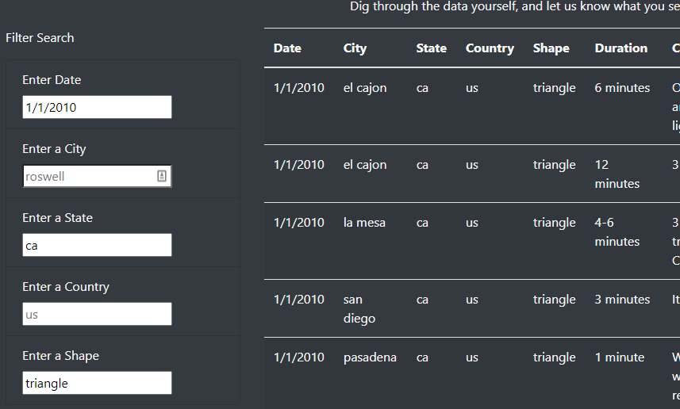

# UFOs
 Javascript

### Module 11 UFOs Challenge 
**App Js:** [UFO js](static/js/app.js)
**Index Html:** [Webpage Html](index.html)

## Overview of UfOs Challenge:
The purpose of this analysis is to build new filters to update our table accordingly.

## Results:
- When looking for a particular row or rows in the table of the webpage, we use the filters to let the user filter the table with an updated table.
- After inputing valid information into the input bar, after clicking off that input bar, the table will automatically update with the desired information.

## Summary:
- 

 

